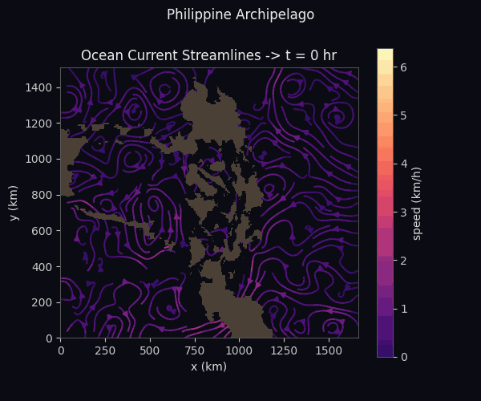

# Ocean Current Modeling with Gaussian Processes

Reconstructing and forecasting ocean surface currents in the Philippine
Archipelago — first by visualizing the measured flow field, then by modeling
it as a Gaussian Process to interpolate unobserved times and drive long-range
particle simulations.



> Based on the environmental-data module of MITx **6.419x** (*Data Analysis:
> Statistical Modeling and Computation in Applications*). The problem framing
> and data are from the course (flow field courtesy of the
> [MSEAS group at MIT](http://mseas.mit.edu/)); the visualization layer here is
> original, and the Gaussian Process and particle-simulation components are
> reimplemented from scratch and extended beyond the original assignment.

## What works now

- **Data loading** — reads the ocean-flow CSVs (100 snapshots, 3 hours
  apart) and the land/water mask into clean NumPy arrays.
- **Flow-field visualization** (`oceangp.viz`) — speed heatmaps, vector
  (quiver) fields, and streamlines, as time animations.
  The animations feature a dark theme, a perceptually-trimmed colormap so slow
  currents stay visible, and a land overlay driven by the archipelago mask.

## Roadmap

- [x] Data + mask loading
- [x] animated flow-field visualization (speed, quiver, streamlines)
- [ ] Gaussian Process regression from scratch — squared-exponential kernel,
      Cholesky-based conditioning
- [ ] Hyperparameter selection — cross-validation grid search **and**
      marginal-likelihood optimization (`scipy.optimize`)
- [ ] Benchmark against `sklearn.gaussian_process.GaussianProcessRegressor`
- [ ] Monte Carlo spatial-correlation analysis
- [ ] Particle-trajectory simulator, extended to ~300 days via GP-interpolated flow
- [ ] Interactive demo (Gradio + Plotly) on Hugging Face Spaces

## Project structure

```
ocean-gp/
├── oceangp/
│   ├── data.py          # flow + mask loading, shared colormap
│   ├── viz.py           # plots and animations
│   ├── gp.py            # Gaussian process model (in progress)
│   └── simulator.py     # particle-flow simulator (planned)
├── notebooks/
│   └── 01_explore.ipynb # data exploration and animations
├── assets/              # exported GIFs used in this README
├── tests/
├── requirements.txt
└── README.md
```

## Setup

```bash
git clone https://github.com/Vinod281997/ocean-gp.git
cd ocean-gp
python -m venv .venv
source .venv/bin/activate          
pip install -r requirements.txt
```

### Data

The flow data is not committed (it is not mine to redistribute). Download
`gp_homework_data.tar.gz` from the MITx 6.419x course materials and extract it
into `data/`, giving a folder of `*u.csv` / `*v.csv` files and `mask.csv`.

## Usage

```python
from oceangp.data import load_data, load_mask
from oceangp import viz

u, v = load_flow("data/OceanFlow")
land = load_mask("data/OceanFlow")

# animated streamlines, dark theme, islands masked, saved as a GIF
viz.animate_streamlines(u, v, density=1.5, land_mask=land,
                        out_path="assets/flow_streamlines.gif")
```

## Built with

NumPy · SciPy · Matplotlib · scikit-learn · pandas