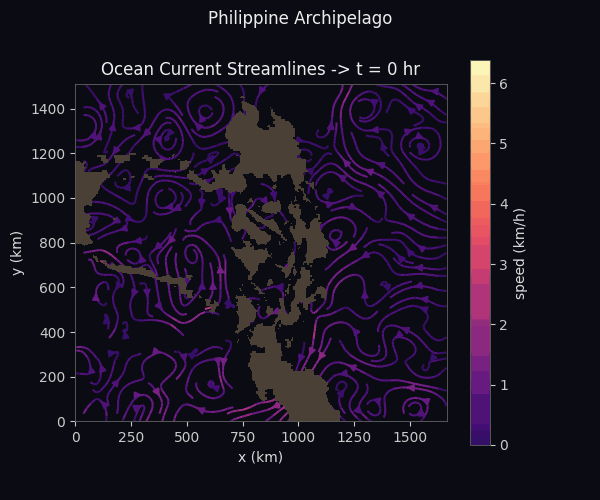

# Ocean Current Modeling with Gaussian Processes

Gaussian-process modeling of ocean surface currents in the Philippine
Archipelago. The project reconstructs current fields between observed time
snapshots and will use the interpolated flow field for particle-trajectory
simulation.

The dataset was produced by the
[MIT MSEAS group](http://mseas.mit.edu/) and contains 100 current-field
snapshots at three-hour intervals, together with a land/water mask.



## Current status

- [x] Load the horizontal and vertical current components and land/water mask
- [x] Visualize speed, vector fields, and streamlines as animations
- [x] Implement the squared-exponential kernel and exact GP regression
- [x] Use Cholesky-based conditioning for stable fitting and prediction
- [x] Evaluate the log marginal likelihood
- [x] Optimize GP hyperparameters with multistart marginal-likelihood optimization
- [ ] Implement 10-fold blocked temporal cross-validation and NLPD-based
      hyperparameter selection
- [ ] Simulate particle trajectories using GP-interpolated currents

## Project structure

```text
ocean-gp/
├── oceangp/
│   ├── data.py             # Data and mask loading
│   ├── kernels.py          # GP covariance kernels
│   ├── gp.py               # GP fitting, prediction, and MLL optimization
│   ├── model_selection.py  # Blocked CV and NLPD grid search (planned)
│   ├── viz.py              # Flow-field plots and animations
│   └── simulator.py        # Particle simulation (planned)
├── notebooks/
│   └── 01_explore.ipynb
├── assets/
├── pyproject.toml
└── requirements.txt
```

## Setup

```bash
git clone https://github.com/Vinod281997/ocean-gp.git
cd ocean-gp
python -m venv .venv
source .venv/bin/activate
pip install -r requirements.txt
```

## Data

The MSEAS data is not included in this repository. Place the `*u.csv`,
`*v.csv`, and `mask.csv` files under `data/OceanFlow/` before running the
notebook or package code.

## Built with

NumPy · SciPy · pandas · Matplotlib
